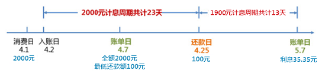

# 信用卡利息计算
## 概念
* 入账日: 一般是产生具体消费后的第二天时，该笔消费才被正式计入账单。
* 记账日(账单日)：指发卡银行每月会定期对信用卡账户当期发生的各项交易，费用等进行汇总结算，并结计利息，计算当期总欠款金额和最小还款额，并发出对账单。
* 还款日：必须偿还当期欠款的日期，没在还款日当日还清，就会产生透支利息。
* 免息还款期：从银行记账日起至到期还款日之间的日期为免息还款期。  

## 无息
在还款日前完成全部还款，不产生利息。  
容差：（[招行](https://cc.cmbchina.com/content/cusservice/45.htm)）如持卡人当期发生不足额还款，且未还款金额不超过100元人民币或10美元，可享受免息待遇的消费交易不额外计收利息和违约金。  
容时：有的银行即使超出还款期3天内还款也可。
## 有息
1. [中国银行信用卡服务收费及计息方式说明](https://www.boc.cn/bcservice/bc3/bc31/201203/t20120331_1767028.html)
2. https://cc.cmbchina.com/content/cusservice/45.htm
### 满足最低还款
一般最低还款额是账单总额的10%（招行为5%）。还最低还款额不会产生逾期，但是会**按月计收高额复利**，不入征信。  
对不符合免息条件的全部欠款（比如提现）以透支交易入账日为起息日收取利息，透支利率为日利率万分之五，对应的年化利率约为18.25%。 

[招行](https://cc.cmbchina.com/content/cusservice/44.htm)最低还款额 = 5%信用卡账户当期消费欠款 + 100%账户内当期预借现金欠款 + 100%账户内当期分期欠款 + 5%账户内所有往期欠款 + 100%上期最低还款额未还清部分 + 100%超过账户信用额度使用的全部款项 + 100%当期费用 + 100%当期利息  

-------------------------------
-------------------------------
#### 利息计算——按月复利（循环利息）
**例1**  
持卡人的账单日为每月7日，在4月1日刷卡消费2000元，4月2日该笔消费入账，4月7日的账单上会显示“本期应还金额”为2000元，“最低还款额”为100元。若持卡人在到期还款日4月25日只偿还100元，则5月7日的账单上会显示截至当日需支付的利息，即  
2000元循环信用本金23天的利息和还款后剩余的1900元本金13天的利息：2000元×0.05%×23天(4月2日-4月24日)+1900元×0.05%×13天(4月25日-5月7日)=23元+12.35元=35.35元。  

**[例2](https://zhuanlan.zhihu.com/p/266792085)**  
承上，5月25日还款200元，那么6月7日账单日的账单为：    
注意利息已经计入本月本金中  
1935.35\*18\*0.05%=17.42 (5月7日-5月25日)  
(1935.35-200)\*14\*0.05%=12.15 (5月25日-6月7日)  
(1935.35-200)+17.42+12.15=1764.92  
合计需要还1764.92元，其中利息为29.57。  

---------------------------
---------------------------

### 逾期（不满足最低还款）
除上述外，增加了[违约金](https://cc.cmbchina.com/content/cusservice/44.htm)和罚息（2017年取消了信用卡滞纳金）。  
**违约金**： 若持卡人未能在到期还款日（含）前还清上期账单最低还款额，我行将根据《招商银行信用卡章程》，按最低 还款额未还部分的5%计收相应的违约金，最低收取人民币10元或或美金1元。  
**罚息**：全额罚息和未清偿罚息两种。
### 提现
提现收取有手续费和利息费用。  
手续费依据卡类不同进行不同的收取方式。  
利息日万分之五，从入账日起息。

## 其他
针对信用卡复利过高，最高法给出相应司法解释。  
根据新的《银行卡规定》，最高法院明确，“发卡行请求持卡人按照信用卡合同的约定给付透支利息、复利、违约金等，或者给付分期付款手续费、利息、违约金等，持卡人以发卡行主张的总额过高为由请求予以适当减少的，人民法院应当综合考虑国家有关金融监管规定、未还款的数额及期限、当事人过错程度、发卡行的实际损失等因素，根据公平原则和诚信原则予以衡量，并作出裁决”。这实际上给予了法官较大的裁量空间。
